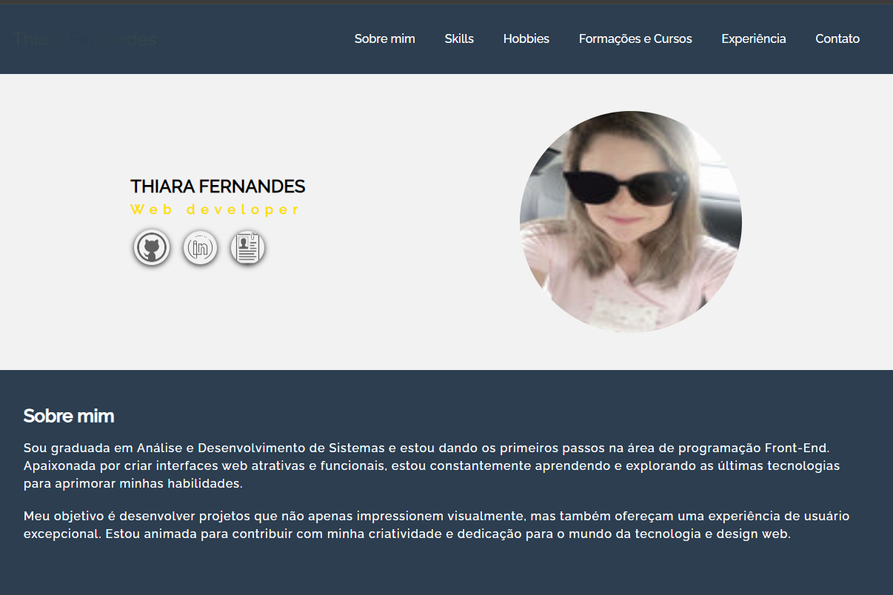
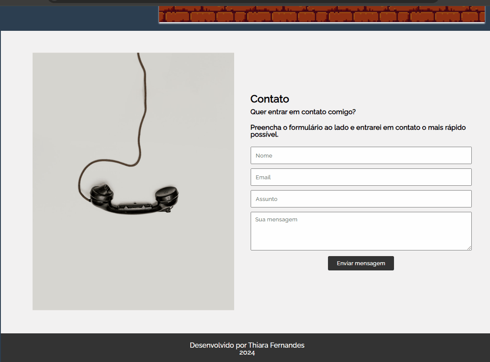

 
 

# Challenge Portfólio com validação de formulário
  #### Projeto desenvolvido no programa ONE - Alura e Oracle
  A criação de um portfólio de projetos é um passo essencial para consolidar os conhecimentos adquiridos durante os estudos.
  

  ## 🛠️Funcionalidades do projeto
  Projeto com design responsivo que permite que o usuário acesso de dispositivos diferentes.

  
  

  Validação de formulário.

  ## ⌨️Tecnologias utilizadas
   - HTML
   - CSS
   - JavaScript

   ## 🔗Acesso ao projeto
   Acesse: (https://thiarafernandes.github.io/challenge-portfolio/)

